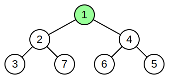
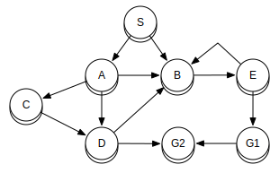

# Computer Science in TypeScript

Collection of classic computer science algorithms and paradigms written in TypeScript.

## Sorting

| Name      |    Best    |  Average   |   Worst    |  Memory  |       Stable       |
| --------- | :--------: | :--------: | :--------: | :------: | :----------------: |
| Bubble    |    `n`     |   `n^2`    |   `n^2`    |   `1`    | :white_check_mark: |
| Selection |   `n^2`    |   `n^2`    |   `n^2`    |   `1`    |        :x:         |
| Insertion |    `n`     |   `n^2`    |   `n^2`    |   `1`    | :white_check_mark: |
| Merge     | `n log(n)` | `n log(n)` | `n log(n)` |   `n`    | :white_check_mark: |
| Quick     | `n log(n)` | `n log(n)` |   `n^2`    | `log(n)` |        :x:         |
| Heap      | `n log(n)` | `n log(n)` | `n log(n)` |   `1`    |        :x:         |

## Data structure

### Linked List

  

### Doubly Linked List

  

### Stack

  

### Queue

  

### Heap

  

### Binary Search Tree

  

### Graph

  

## Algorithms

- Binary Search

## References

- [Algorithms data structures concepts](https://medium.com/@codingfreak/top-algorithms-data-structures-concepts-every-computer-science-student-should-know-e0549c67b4ac)
- [Common data structures that every progammer must know](https://towardsdatascience.com/8-common-data-structures-every-programmer-must-know-171acf6a1a42)
- [Computer science in JavaScript](https://github.com/humanwhocodes/computer-science-in-javascript)

## Licence

MIT
